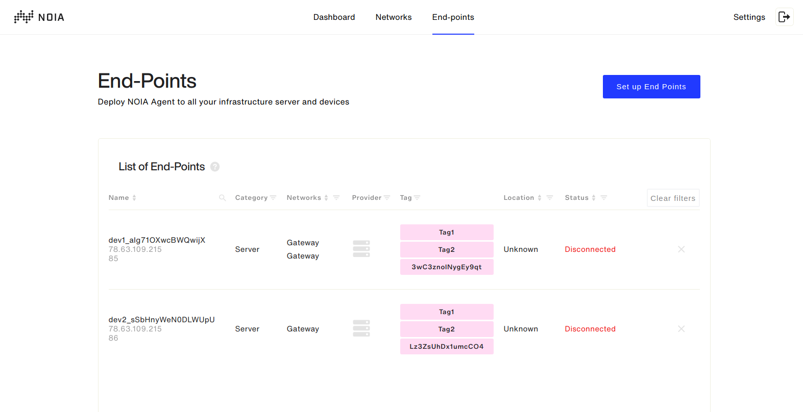
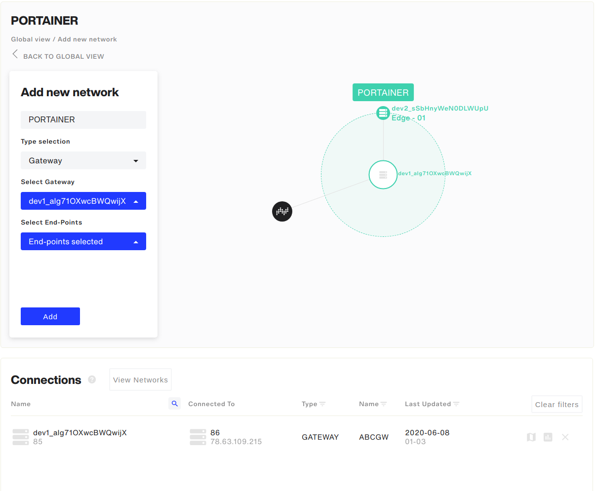

**Prerequisites:**

* Wireguard kernel module is installed and loaded:
```bash
lsmod | grep wireguard
```

* Optional:  Docker is installed and running: 
```sh
docker system info
```

**Steps:**

1. Login to [https://platform.noia.network](https://platform.noia.network) 
2. Create API key (Settings > API keys)

---


3. **Install NOIA Agent:**

Possible versions:

Stable:  ```noia/agent:prod```
Development:  ```noia/agent:devel``` or ```noia/agent:latest```  

### with Docker: 

```bash
docker run --network="host" --restart=on-failure:10 --cap-add=NET_ADMIN --cap-add=SYS_MODULE -v /var/run/docker.sock:/var/run/docker.sock \
--device /dev/net/tun:/dev/net/tun --name=noia-agent -e NOIA_API_KEY='z99CuiZnMhe2qtz4LLX43Gbho5Zu9G8oAoWRY68WdMTVB9GzuMY2HNn667A752EA' \
-e NOIA_CONTROLLER_URL='app-controller-platform-agents.noia.network' -e NOIA_NETWORK_API='docker' -d noia/agent:prod
```
Check agent logs:
```docker logs noia-agent```

More information:     [https://bitbucket.org/noianetwork-team/platform-agent/src/master/DOCKER.md](https://bitbucket.org/noianetwork-team/platform-agent/src/master/DOCKER.md)

---
### Docker-compose

** With Portainer agent:**

```bash
curl  https://bitbucket.org/noianetwork-team/platform-agent/raw/669636b38f3c9016533b6b55576dbba1998b21fa/docker-compose/na-pa.yml \
-o docker-compose.yaml
```

** Without portainer agent:**

```bash
curl  https://bitbucket.org/noianetwork-team/platform-agent/raw/669636b38f3c9016533b6b55576dbba1998b21fa/docker-compose/noia-agent.yaml \
-o docker-compose.yaml
```

Edit ```docker-compose.yaml``` file and edit these environment variables:

```yaml
NOIA_API_KEY= your_api_key
```

Start containers:

```bash
docker-compose up -d
```

Check agent logs:
```bash
docker logs noia-agent
```

P.S. NOIA Agent will ignore the default docker network, you will  need to create a separate network with different subnets on different hosts. Also, subnet 10.69.0.0/16 is used by our agent.

More information:

[https://bitbucket.org/noianetwork-team/platform-agent/src/master/DOCKER_COMPOSE.md](https://bitbucket.org/noianetwork-team/platform-agent/src/master/DOCKER_COMPOSE.md)

---
### pip 

```bash
pip install platform-agent
```

Download systemd service file:

```bash
curl https://bitbucket.org/noianetwork-team/platform-agent/raw/e093bd419a3b3d117bad5c2acff950e8b16fc36f/systemd/noia-agent.service \
-o /etc/systemd/system/noia-agent.service
```

Edit settings file ```/etc/noia-agent/config.ini``` and change these settings:

```ini
[SECRETS] 
api_key=z99CuiZnMhe2qtz4LLX43Gbho5Zu9G8oAoWRY68WdMTVB9GzuMY2HNn667A752EA 
```

```bash
systemctl  daemon-reload
```

```bash
systemctl enable --now noia-agent
```

Check if service is running:
```bash
systemctl status noia-agent
```

More information: [https://bitbucket.org/noianetwork-team/platform-agent/src/master/README.md](https://bitbucket.org/noianetwork-team/platform-agent/src/master/README.md)

---

4. 
**Install NOIA Agent on Portainer:**

1. Select image:


2. Select network (Agent **MUST** run in the host network): 


3. Add environment variables:

### Mandatory variables:

```ini
NOIA_API_KEY= your_api_key
```

#### Metadata (Optional)
```ini
-e NOIA_NETWORK_API='docker'
-e NOIA_NAME='Azure EU gateway '
-e NOIA_COUNTRY='Germany'
-e NOIA_CITY='Frankfurt'

#Select one of the categories from the list or default will be assigned 
# 'zIoT','Server','none' 
-e NOIA_CATEGORY='IoT'

#Select one of providers from the list or default will be assigned 
#'AWS', 'DigtialOcean', 'Microsoft Azure', 'Rackspace', 'Alibaba Cloud', 
#'Google Cloud Platform', 'Oracle Cloud', 'VMware', 'IBM Cloud', 'Vultr'. 

-e NOIA_PROVIDER ='Microsoft Azure'
-e NOIA_LAT='40.14'
-e NOIA_LON='-74.21'
```


(noia agent will read docker subnets and report them to the controller). If this variable is selected, you also need to add docker.sock as a read-only volume;


4. Add additional capabilities (NET_ADMIN and SYS_MODULE): 


5. All agents will appear in NOIA Platform as endpoints:




6. To connect endpoints to a network, select Networks > Add new network. Input Network name, select Type (if you want connect multiple Portainer agents to Portainer, choose Gateway and select Portainer host as a gateway and select agents which you want to connect), then click Add: 



